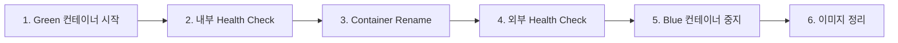

# Behindy 배포 프로세스 문서

## 목차
1. [개요](#개요)
2. [아키텍처 변경사항](#아키텍처-변경사항)
3. [멀티레포 구조](#멀티레포-구조)
4. [Blue/Green 배포 전략](#bluegreen-배포-전략)
5. [CI/CD 파이프라인](#cicd-파이프라인)
6. [리소스 관리](#리소스-관리)
7. [트러블슈팅](#트러블슈팅)

---

## 개요

### 프로젝트 정보
- **서비스명**: Behindy
- **도메인**: https://behindy.me
- **인프라**: AWS EC2 (t2.small, 2GB RAM + 2GB Swap)
- **컨테이너**: Docker + Docker Compose
- **레지스트리**: Docker Hub

### 배포 목표
- **무중단 배포**: Blue/Green 전략으로 다운타임 최소화
- **리소스 효율성**: 제한된 EC2 자원 최적 활용
- **독립 배포**: 각 서비스별 독립적인 배포 프로세스

---

## 아키텍처 변경사항

### 이전 (단일 레포)
```
behindy-build/
├── frontend/
├── backend/
├── llmserver/
└── .github/workflows/deploy.yml  # 통합 배포
```

**문제점**:
- EC2에서 3개 서비스 동시 빌드 → 메모리 부족 (OOM)
- 하나의 서비스 변경 시 전체 재배포
- Blue/Green 배포 불가능 (리소스 부족)

### 현재 (멀티 레포)
```
behindy-frontend/        # Next.js
behindy-backend/         # Spring Boot
behindy-llmserver/       # FastAPI
behindy-ops/             # 운영 스크립트
```

**개선사항**:
- ✅ GitHub Actions에서 빌드 → EC2 부담 제거
- ✅ Docker Hub를 통한 이미지 배포
- ✅ 서비스별 독립 배포
- ✅ Blue/Green 배포 가능

---

## 멀티레포 구조

### 1. Frontend (behindy-frontend)
**기술스택**: Next.js 14, TypeScript, TailwindCSS

**저장소**: https://github.com/behindy3359/behindy-frontend

**주요 환경변수**:
```env
NEXT_PUBLIC_API_URL=https://behindy.me/api
NEXT_PUBLIC_AI_URL=https://behindy.me/ai
NEXT_PUBLIC_TOKEN_KEY=behindy_access_token
NEXT_PUBLIC_REFRESH_TOKEN_KEY=behindy_refresh_token
```

**빌드 산출물**: Docker 이미지 (`behindy-frontend:latest`)

### 2. Backend (behindy-backend)
**기술스택**: Spring Boot 3.x, Java 17, PostgreSQL, Redis

**저장소**: https://github.com/behindy3359/behindy-backend

**주요 환경변수**:
```env
SPRING_DATASOURCE_URL=jdbc:postgresql://db:5432/behindy
JWT_SECRET=<secret>
SEOUL_METRO_API_KEY=<api-key>
AI_SERVER_URL=http://llmserver:8000
```

**빌드 산출물**: Docker 이미지 (`behindy-backend:latest`)

### 3. LLMServer (behindy-llmserver)
**기술스택**: FastAPI, Python 3.11, OpenAI/Claude API

**저장소**: https://github.com/behindy3359/behindy-llmserver

**주요 환경변수**:
```env
AI_PROVIDER=openai
OPENAI_API_KEY=<api-key>
REDIS_URL=redis://redis:6379
```

**빌드 산출물**: Docker 이미지 (`behindy-llmserver:latest`)

### 4. Operations (behindy-ops)
**저장소**: https://github.com/behindy3359/behindy-ops

**구조**:
```
behindy-ops/
├── docker-compose.yml       # 서비스 오케스트레이션
├── nginx/
│   └── nginx.conf           # Nginx 설정
├── scripts/
│   ├── switch-upstream.sh   # Blue/Green 전환 스크립트
│   └── deploy.sh            # 수동 배포 스크립트
├── documents/
│   └── DEPLOYMENT_PROCESS.md
└── .env                     # 환경변수 (비공개)
```

---

## Blue/Green 배포 전략

### 개념
Blue/Green 배포는 두 개의 동일한 환경(Blue, Green)을 유지하며, 새 버전을 Green에 배포한 후 트래픽을 전환하는 방식입니다.

### 구현 방식

#### 1. Docker 컨테이너 네이밍 전략
```
Blue (현재):  frontend, backend, llmserver
Green (신규): frontend-green, backend-green, llmserver-green
```

#### 2. Nginx 라우팅
Nginx는 항상 `frontend`, `backend`, `llmserver` 이름으로 라우팅합니다.
배포 시 컨테이너를 `docker rename` 명령으로 전환합니다.

```nginx
# Nginx upstream (변경 불필요)
upstream frontend {
    server frontend:3000;
}

upstream backend {
    server backend:8080;
}
```

#### 3. 배포 프로세스


**세부 단계**:

1. **Green 컨테이너 시작**
   - Docker Hub에서 최신 이미지 pull
   - `{service}-green` 이름으로 컨테이너 시작
   - 같은 Docker network에 연결 (`behindy-ops_internal`)

2. **내부 Health Check**
   - Nginx 컨테이너에서 Green 컨테이너로 직접 요청
   - 예: `docker exec nginx curl -sf http://frontend-green:3000`
   - 최대 15회 재시도 (간격 3초)

3. **Container Rename (트래픽 전환)**
   ```bash
   docker rename frontend frontend-blue
   docker rename frontend-green frontend
   ```
   - Nginx upstream이 자동으로 새 컨테이너로 라우팅
   - **다운타임: 1-2초 이내**

4. **외부 Health Check**
   - 실제 도메인(`https://behindy.me`)으로 검증
   - Nginx → 새 컨테이너 전체 경로 확인

5. **Blue 컨테이너 중지**
   - 이전 버전 컨테이너 정리
   - 롤백 필요 시 이미지는 유지됨

6. **이미지 정리**
   - 최신 2개 이미지만 유지
   - 디스크 공간 절약

### 리소스 사용량

| 단계 | Frontend | Backend | LLMServer | 합계 |
|------|----------|---------|-----------|------|
| Blue 실행 중 | 400MB | 300MB | 250MB | 950MB |
| Green 시작 | +400MB | +300MB | +250MB | +950MB |
| **최대 순간** | **800MB** | **600MB** | **500MB** | **1.9GB** |
| Blue 중지 후 | 400MB | 300MB | 250MB | 950MB |

**가용 메모리**: 850MB (여유분)
**결론**: 서비스별 독립 배포로 순간 메모리 사용량을 800MB 이하로 유지 가능

---

## CI/CD 파이프라인

### GitHub Actions 워크플로우

#### 전체 흐름
```
[Git Push to main]
    ↓
[GitHub Actions Trigger]
    ↓
[Build Job - GitHub Runner]
    ├─ Checkout code
    ├─ Docker Buildx setup
    ├─ Login to Docker Hub
    ├─ Build image with cache
    └─ Push to Docker Hub
    ↓
[Deploy Job - Self-hosted Runner (EC2)]
    ├─ Pull latest image
    ├─ Determine Blue/Green
    ├─ Start Green container
    ├─ Internal health check
    ├─ Container rename
    ├─ External health check
    ├─ Stop Blue container
    └─ Cleanup old images
```

### 1. Build Job (GitHub-hosted)

**실행 환경**: `ubuntu-latest` (GitHub 제공)

```yaml
build:
  runs-on: ubuntu-latest
  steps:
    - name: Build and push Docker image
      uses: docker/build-push-action@v4
      with:
        context: .
        push: true
        tags: |
          ${{ secrets.DOCKERHUB_USERNAME }}/behindy-frontend:latest
          ${{ secrets.DOCKERHUB_USERNAME }}/behindy-frontend:${{ github.sha }}
        cache-from: type=registry,ref=.../buildcache
        cache-to: type=registry,ref=.../buildcache,mode=max
```

**특징**:
- GitHub의 무료 리소스 사용 (8GB RAM)
- Docker layer caching으로 빌드 시간 단축
- 커밋 SHA 태그 + latest 태그 동시 생성

### 2. Deploy Job (Self-hosted)

**실행 환경**: EC2 인스턴스 (self-hosted runner)

```yaml
deploy:
  runs-on: self-hosted
  needs: build
  steps:
    - name: Determine deployment color
      # Blue/Green 판별 로직

    - name: Start new container
      # Green 컨테이너 시작

    - name: Health check (internal)
      # 내부 네트워크 검증

    - name: Switch Nginx upstream
      # docker rename으로 트래픽 전환

    - name: Health check (external)
      # 외부 도메인 검증

    - name: Stop old container
      # Blue 컨테이너 정리

    - name: Cleanup old images
      # 오래된 이미지 삭제
```

### Health Check 엔드포인트

각 서비스는 외부 도메인을 통해 검증합니다:

| 서비스 | 내부 체크 | 외부 체크 |
|--------|-----------|-----------|
| Frontend | `http://frontend-green:3000` | `https://behindy.me/` |
| Backend | `http://backend-green:8080/actuator/health` | `https://behindy.me/api/actuator/health` |
| LLMServer | `http://llmserver-green:8000/health` | `https://behindy.me/api/ai-stories/health` |

**외부 체크의 중요성**:
- Nginx 라우팅 검증
- CORS, Rate Limiting 등 보안 설정 확인
- 실제 사용자 경로와 동일한 검증

---

## 리소스 관리

### 메모리 관리

**현재 상태**:
```
Total Memory: 1.9GB
Used: 1.1GB
Free: 153MB
Available: 851MB

Swap: 2.0GB
Used: 213MB
Free: 1.8GB
```

**컨테이너별 메모리 제한**:
```yaml
frontend:
  deploy:
    resources:
      limits:
        memory: 2G
      reservations:
        memory: 1G
```

### 디스크 관리

#### 이미지 정리 전략
각 배포 시 해당 프로젝트의 **최신 2개 이미지만 유지**:

```bash
# 현재 프로젝트 이미지만 필터링
docker images $USERNAME/behindy-frontend --format "{{.ID}} {{.CreatedAt}}" | \
  sort -rk 2 | \                    # 생성일시 역순 정렬
  awk 'NR>2 {print $1}' | \         # 3번째부터 추출
  xargs -r docker rmi -f || true    # 삭제 (에러 무시)

# dangling 이미지 정리
docker image prune -f
```

**효과**:
- ✅ Blue/Green 롤백 가능 (최신 2개 유지)
- ✅ 무한정 증가 방지
- ✅ 다른 프로젝트 이미지 영향 없음

#### 로그 관리
```yaml
logging:
  driver: "json-file"
  options:
    max-size: "10m"
    max-file: "3"
```

각 컨테이너당 최대 30MB (10MB × 3파일)

---

## 트러블슈팅

### 1. 배포 실패 시

#### 증상: Green 컨테이너 Health Check 실패
```bash
✗ Health check failed - Frontend not responding
```

**원인**:
- 빌드된 이미지 오류
- 환경변수 누락
- 의존 서비스 미실행 (DB, Redis)

**해결**:
1. 컨테이너 로그 확인:
   ```bash
   docker logs frontend-green --tail=100
   ```

2. 환경변수 확인:
   ```bash
   docker exec frontend-green env | grep NEXT_PUBLIC
   ```

3. 수동 롤백:
   ```bash
   docker stop frontend-green
   docker rm frontend-green
   # Blue 컨테이너는 그대로 유지됨
   ```

### 2. 메모리 부족 (OOM)

#### 증상
```bash
Container killed by OOM
```

**원인**: Blue + Green 동시 실행 시 메모리 초과

**해결**:
1. Blue 컨테이너 즉시 중지:
   ```bash
   docker stop frontend-blue
   ```

2. Swap 활용 확인:
   ```bash
   free -h
   swapon --show
   ```

3. 필요 시 컨테이너 메모리 제한 조정

### 3. Docker Network 문제

#### 증상: 컨테이너 간 통신 불가
```bash
curl: (6) Could not resolve host: backend
```

**원인**: Docker network 미연결

**해결**:
```bash
# Network 존재 확인
docker network ls | grep behindy-ops_internal

# 컨테이너 network 연결 확인
docker inspect frontend-green | grep NetworkMode

# 수동 연결
docker network connect behindy-ops_internal frontend-green
```

### 4. Nginx 라우팅 실패

#### 증상: 502 Bad Gateway

**원인**:
- 컨테이너 이름 불일치
- 컨테이너 미실행

**해결**:
1. Nginx 로그 확인:
   ```bash
   docker logs nginx --tail=50
   ```

2. Upstream 상태 확인:
   ```bash
   docker exec nginx curl -sf http://frontend:3000
   ```

3. Container rename 재실행:
   ```bash
   docker rename frontend-green frontend
   ```

### 5. 이미지 정리 실패

#### 증상: 디스크 공간 부족
```bash
Error: No space left on device
```

**해결**:
```bash
# 사용하지 않는 모든 리소스 정리
docker system prune -a --volumes

# 특정 이미지만 삭제
docker images | grep behindy-frontend | awk '{print $3}' | xargs docker rmi -f
```

---

## 배포 체크리스트

### 배포 전
- [ ] GitHub Secrets 설정 확인
- [ ] `.env` 파일 최신 상태 확인
- [ ] Self-hosted runner 실행 중 확인
- [ ] 메모리 사용량 확인 (`free -h`)
- [ ] 디스크 공간 확인 (`df -h`)

### 배포 중
- [ ] GitHub Actions 진행 상황 모니터링
- [ ] Build job 성공 확인
- [ ] Green 컨테이너 시작 확인
- [ ] Internal health check 통과
- [ ] External health check 통과
- [ ] Blue 컨테이너 정리 완료

### 배포 후
- [ ] 서비스 정상 동작 확인 (https://behindy.me)
- [ ] 메모리 사용량 정상 범위 확인
- [ ] 로그 에러 없음 확인
- [ ] 이미지 정리 완료 확인 (`docker images`)

---

## 참고 자료

### 관련 문서
- [MIGRATION_GUIDE.md](../MIGRATION_GUIDE.md) - 단일레포에서 멀티레포 전환 가이드
- [README.md](../README.md) - behindy-ops 전체 개요

### 저장소
- Frontend: https://github.com/behindy3359/behindy-frontend
- Backend: https://github.com/behindy3359/behindy-backend
- LLMServer: https://github.com/behindy3359/behindy-llmserver
- Operations: https://github.com/behindy3359/behindy-ops

### 유용한 명령어
```bash
# 전체 컨테이너 상태 확인
docker ps --format "table {{.Names}}\t{{.Status}}\t{{.Ports}}"

# 특정 서비스 로그 실시간 확인
docker logs -f frontend

# 리소스 사용량 모니터링
docker stats

# Network 상태 확인
docker network inspect behindy-ops_internal
```

---

**최종 업데이트**: 2025-11-10
**작성자**: Behindy DevOps Team
